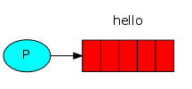

RabbitMQ is Message Broker.  
RabbitMQ fulfills a role of post office.  
RabbitMQ stores and forwards binary blobs of data.  

## Jargon of some RabbitMQ
### producer
a program that sends massages

### queue
This is post box which lives inside RabbitMQ. Message is only stored inside a *queue*. Many *producers* can send message to one queue, and many *consumers* try to receive data from one queue.

### consumer
a program that mostly waits to receive messages

## "Hello Workd" application of RabbitMQ in Java
In the first, two program write:
- a producer that sends s single message
- a consumer that receives messages and prints them out

### Sending

This class call our message publisher(sender) and our message consumer(receiver). The publisher will connect to RabbitMQ. After send single message, then exit.

### Receiving
Consumer is pushed messages from RabbitMQ.

Setting up is the same as publisher. It open a connection and a channel, and declare the queue from which we're going to consume.

Note that we declare the queue here. Because we might start the consumer before the publisher, we want to make sure the queue exists before we try to consume messages from it.

This tell the server to deliver the messages from queue. Message is asynchronously pushed.
